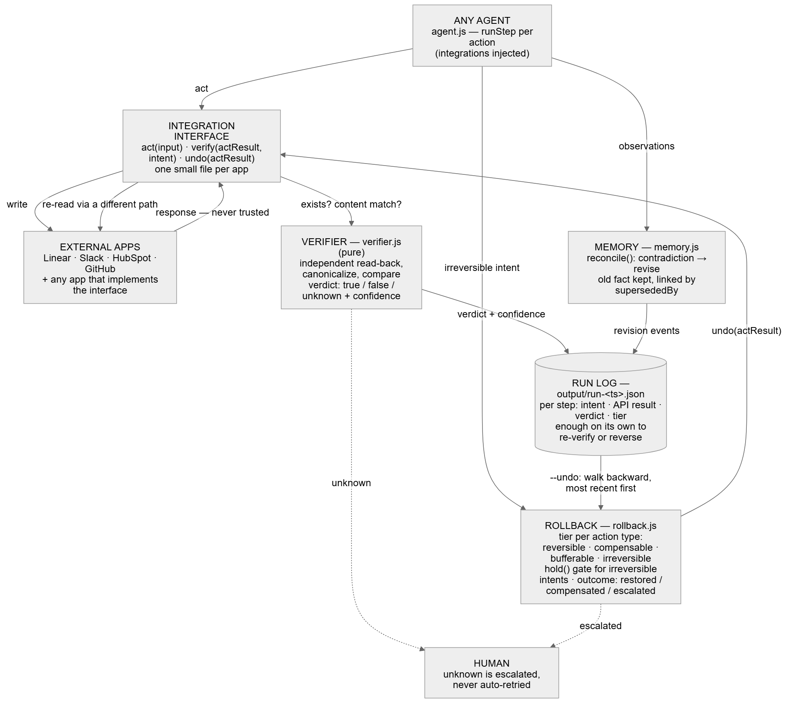
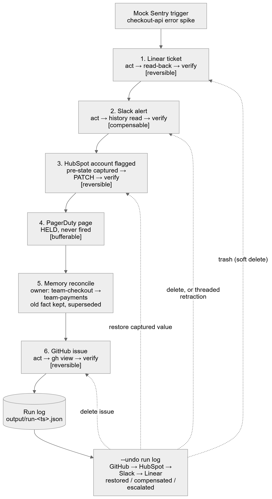

# Incident Responder Agent

A demo agent for the Multi-App AI Agent Hackathon, built to prove one idea:

> **Every action an agent takes gets logged, classified, independently verified, and is reversible.** Git blame and git revert, for the real world your agent touches.

The agent itself is deliberately simple — one incident-response flow from a Sentry issue across Linear, Sentry, Slack, HubSpot, PagerDuty, and GitHub, with a cheap open model (DeepSeek via OpenRouter) writing the diagnosis. The interesting part is the **trust layer** underneath it, which any agent that mutates external systems can adopt. It's modular, has no dependency on the agent, and will be open-sourced separately after the hackathon.

## Demo

**Pitch video (2 min):** _link coming_ · **Demo video (2 min):** [`demos/incident-responder/output/final-demo.mp4`](demos/incident-responder/output/final-demo.mp4) — recorded against the live systems, nothing mocked: a real Sentry issue → DeepSeek diagnosis → Linear, Sentry, Slack, HubSpot, GitHub → the held PagerDuty page committed by a human → everything undone.


*Recorded with [aidemo](https://github.com/tandryukha/aidemo): the storyboard is code (`demos/incident-responder/generated/storyboard.json`), replayed deterministically in Chrome, narrated by a local Kokoro voice. `SUBMISSION.md` has the written brief.*



*Editable sources: [`diagrams/trust-layer-architecture.excalidraw`](diagrams/trust-layer-architecture.excalidraw) (open at excalidraw.com) and the `.mmd` mermaid next to it.*

## Connected apps

Seven real integrations, all exercised live (create → verify → undo) against real accounts, plus one model. Each mutating app implements the same three functions — `act` / `verify` / `undo` — in one small file under `src/integrations/`.

| App | Role in the flow | Action | How it's verified (independent path) | Undo | Tier | Auth |
|---|---|---|---|---|---|---|
| **Sentry** | trigger + action | latest unresolved issue starts the run (webhook or `--sentry`); a note linking the ticket is posted on the issue | list the issue's notes, match id + text | delete the note | reversible | user auth token (`event:read/write`, `project:read`) |
| **Linear** | action | creates the incident ticket | GraphQL read by id, `trashed` treated as gone, content match | `issueDelete` (soft delete → trash) | reversible | personal API key |
| **Slack** | action | posts the alert to `#ops-alerts` | `conversations.history` at that `ts`, canonicalized text match (unwraps `<url>`) | `chat.delete`, or a threaded retraction if delete is refused | compensable | bot token, invited to the channel |
| **HubSpot** | action | flags the affected company: `incident_status = investigating` | GET the property back | PATCH the captured pre-state value back | reversible | private app token (`crm.objects.companies.read/write`) |
| **PagerDuty** | action, gated | incident on the service — **held**, fired only by `--commit` | list incidents by `incident_key` (not the create response) | resolve the incident; the page itself can't be un-sent | bufferable → compensable | REST API key + `From` user |
| **GitHub** | action | opens an issue in the demo repo | `gh issue view` by number, content match; "could not resolve" = definitively gone | delete via GraphQL, or close if delete is refused | reversible | `gh` CLI keyring |
| **OpenRouter → DeepSeek** | reasoning | `deepseek/deepseek-v4-flash` reads the issue + stack frames, writes diagnosis / cause / severity | not verified (prose, not an action) — logged with model id + prompt hash; audited fallback to a template | n/a | — | API key |

Four of the six mutating apps also expose a **second source** (`findByContent`) for wrong-record recovery: Linear (issues by exact title since run start), GitHub (`gh issue list --search`), Slack (recent history, canonical text), Sentry (notes by text). HubSpot and PagerDuty address records by a known id/key, so the case doesn't arise.

Adding an app means one file with those three functions and one line in `TIER_BY_ACTION_TYPE`; nothing in `agent.js` changes. HubSpot, Sentry and PagerDuty were each added after the first three without touching the orchestrator's structure.

## What it does

A Sentry issue kicks off one incident-response cycle — the canned "error spike" payload by default (deterministic for rehearsal), or the latest real unresolved issue in your Sentry org with `--sentry`:

```
Sentry trigger       mock payload, or --sentry: latest real unresolved issue
      │
      ▼
llm.diagnose         DeepSeek reads the issue + stack frames → diagnosis, cause, severity
      │              (not verified — it's prose; logged with model + prompt hash, falls back to a template and says so)
      ▼
Linear ticket        act ─► verify                          [reversible]
      │
      ▼
Sentry note          links the ticket on the issue (--sentry only)   [reversible]
      │
      ▼
Slack alert          act ─► verify                          [compensable]
      │
      ▼
HubSpot account      pre-state captured ─► act ─► verify    [reversible]
      │
      ▼
PagerDuty page       HELD at the gate; fired only by --commit   [bufferable → compensable once committed]
      │
      ▼
memory.reconcile     stale fact revised, old value kept visible
      │
      ▼
GitHub issue         act ─► verify                          [reversible]
```



Every mutating step is written to a run log with its rollback tier and a tri-state verification result. `--undo <run-log>` walks the log backwards and reverses every step it can, reporting exactly what happened to each one.

## The core: a trust layer in three parts

### 1. Tri-state verification (`src/verifier.js`)

An API returning 200 is not proof the write happened, landed on the right record, or wasn't mangled on save. So after every mutation the agent **re-reads through a different code path** and compares against intent.

The result is always `"true" | "false" | "unknown"` — never a bare boolean:

- `true` — independent read confirms the write (with a confidence score)
- `false` — target missing, or content mismatch after canonicalization
- `unknown` — the check itself timed out or a second source disagrees. **Unknown escalates to a human, never auto-retries.** Retry-on-unknown is how agents produce duplicate side effects. `verify()` is a pure function with no I/O handle, so it structurally cannot retry.

Canonicalization absorbs the ways real APIs rewrite content (Slack wraps URLs in `<…>` and strips emphasis; Linear/GitHub normalize line endings). Anything beyond that is a real mismatch.

When a read-back says "doesn't exist", a **second source** gets a vote before that verdict stands (`src/second-source.js`): an exact-content search in the same system, scoped to the run's time window. Exactly one match means the write happened under an id the API never returned — the reference is corrected, re-verified, and the step is marked `correctedVia: "content-search"` with the original id kept. No match: `false` stands. More than one: `unknown`, because guessing which is ours is exactly the kind of thing this layer refuses to do.

### 2. Four-tier rollback (`src/rollback.js`)

"Reversible" is not one thing. Every action type is registered under a tier, and the tier decides what undo can honestly promise:

| Tier | Meaning | Example here |
|---|---|---|
| `reversible` | undo restores the pre-state | Linear ticket, GitHub issue → deleted; HubSpot property → captured value written back |
| `compensable` | the artifact can be removed, but the effect (someone read it) can't be un-happened | Slack message → deleted, or a threaded retraction if delete fails |
| `bufferable` | never fired; held at a gate until an explicit `commit()` | PagerDuty page — a run only *holds* it; `--commit <run-log>` fires it through `hold().commit()`, after which it is compensable (undo resolves the incident, cannot un-page anyone) |
| `irreversible` | no undo can be offered; must be gated up front | not used in this demo |

Rollback outcomes are `restored`, `compensated`, `held-not-fired`, or `escalated` — compensation itself can fail against a third-party API, and that's a terminal state that gets reported, never swallowed.

Fidelity is judged on **agent-writable fields only**. Fields every API touches on every write (`updatedAt`, `revision`, audit-log timestamps) are declared excluded up front. The claim is "exact restoration of agent-writable fields", never "bit-for-bit".

### 3. Self-correcting memory (`src/memory.js`)

A tiny fact store (`subject / predicate / object / source / confidence`) with prediction-error-gated reconsolidation: a new observation that contradicts a stored fact **revises** it — the old fact is marked `supersededBy` and stays in the store, visible — instead of silently appending a second, conflicting fact forever.

The demo seeds a stale belief (`checkout-api ownedBy team-checkout`); the live trigger says `team-payments`; the run log shows the revision with the old value still readable.

## The reusable part: the run log as backend state

Everything above converges on one artifact — the run log written to `output/run-<timestamp>.json`. It is the complete, independently checkable record of what the agent did:

```jsonc
{
  "runId": "…",
  "trigger": { "service": "checkout-api", "errorType": "…", "reportedOwner": "team-payments" },
  "steps": [
    {
      "actionType": "linear.issueCreate",
      "tier": "reversible",
      "input":  { "title": "…", "description": "…" },          // what we intended
      "actResult": { "id": "…", "raw": { "url": "…" } },       // what the API returned
      "verifyResult": {                                        // what an independent read found
        "status": "true", "confidence": 0.85,
        "checks": { "existsCheck": true, "contentMatch": 1, "crossSourceConfirmed": null },
        "reason": "independent read confirms the write"
      }
    },
    { "actionType": "pagerduty.page", "tier": "bufferable", "held": true, "intent": { "reason": "…" } },
    { "actionType": "memory.reconcile", "revised": true, "oldFact": { "object": "team-checkout", "supersededBy": "…" }, "newFact": { "object": "team-payments" } }
  ],
  "factStore": [ /* every fact, including superseded ones */ ]
}
```

Because each step carries its own intent, result, tier, and verification, the log is enough on its own to:

- **walk backward** from any current state to the exact chain of agent actions that produced it,
- **re-verify** any step later by re-reading the target (the run log is all `--undo` needs — no database, no live session),
- **reverse** any step, with the tier telling you honestly what reversal means.

Nothing in the trust layer is specific to incidents. To adopt it, an integration only has to implement three functions:

```js
act(input)              -> { id, raw, capturedBefore }
verify(actResult, intent) -> { status: "true"|"false"|"unknown", confidence, checks, reason }
undo(actResult)         -> { ok, compensationType: "restored"|"compensated"|"escalated" }
```

and register its action types in `TIER_BY_ACTION_TYPE`. `src/agent.js` orchestrates; it takes integrations as an injected object, so the same orchestrator runs against real APIs, fakes, or a fault-injecting harness.

## Evals: the layer proves its own reliability

`npm run eval` reports real numbers, not vibes:

| Eval | What it measures | Result |
|---|---|---|
| #1 Silent-failure catch rate | 4 injected failure shapes (fake 200 / no write, truncated content, wrong record, timeout) × 10 trials — how many never get verified `true` | **10/10 (100%)** |
| #2 Rollback fidelity | 20 act → mutate → undo cycles, diffed on agent-writable fields | **20/20 exact** (excludes `updatedAt`, `revision`, …) |
| #3 Memory scenario accuracy | 8 hand-written revise / confirm / new-fact / unrelated-subject cases | **8/8** |
| #4 Tri-state coverage | verifier emits all three states; `verify()` has no retry side effect | **pass** |
| #5 Confidence calibration | Brier score of confidence vs ground truth over labeled cases | **0.269** (0 = perfect) |
| Stretch: adversarial | poisoned content with embedded instructions is never verified `true` | **blocked** |

Evals run against the verifier and rollback engine directly with in-memory fixtures — repeatable, no API calls. The live flow is exercised separately (below).

## Competitive benchmark: nine products, same faults, same ground truth

`npm run eval:competitive` runs 1,000 create-actions with one seeded fault schedule through nine shipping products' documented defaults and through this layer (which calls the real `verifier.js` / `rollback.js`). Ground truth comes from the simulator's own store, so every row is scored on what *happened*, not what the API said. Full tables with the exact behavior modeled per product, the by-fault breakdown, and caveats are generated into [`eval/competitive/RESULTS.md`](eval/competitive/RESULTS.md).

Faults at 30%: fake-200 (nothing stored), truncated on save, wrong-record (stored, returned id points nowhere), timeout after the write happened, transient 503 before it. Read path 2% flaky.

**Accuracy** (1,000 actions, 277 faults injected)

| product | pattern | silent failures | catch rate | orphaned writes | duplicates | end state correct | calls / action |
|---|---|---|---|---|---|---|---|
| [Composio](https://docs.composio.dev/) | status trust | 164 | 40.8% | 61 | 0 | 77.5% | 1.00 |
| [Arcade.dev](https://docs.arcade.dev/) | status trust | 164 | 40.8% | 61 | 0 | 77.5% | 1.00 |
| [OpenAI Agents SDK](https://openai.github.io/openai-agents-python/tools/) | status trust | 164 | 40.8% | 61 | 0 | 77.5% | 1.00 |
| [LangGraph RetryPolicy](https://reference.langchain.com/python/langgraph/types/RetryPolicy) | retry / replay | 225 | 0.0% | 0 | **61** | 77.5% | 1.11 |
| [Temporal activity retry](https://docs.temporal.io/encyclopedia/retry-policies) | retry / replay | 225 | 0.0% | 0 | **61** | 77.5% | 1.11 |
| [tenacity](https://github.com/jd/tenacity) | retry / replay | 225 | 0.0% | 0 | **61** | 77.5% | 1.11 |
| [Guardrails AI](https://github.com/guardrails-ai/guardrails) | schema validation | 164 | 40.8% | 61 | 0 | 77.5% | 1.00 |
| [Pydantic AI](https://ai.pydantic.dev/tools/) | schema validation | 164 | 40.8% | 61 | 0 | 77.5% | 1.00 |
| [LLM-as-judge (Langfuse / Arize)](https://langfuse.com/docs/evaluation/evaluation-methods/llm-as-a-judge) | response judge, best case | 164 | 40.8% | 61 | 0 | 77.5% | 1.00 |
| **trust layer (this repo)** | independent read-back + second source | **0** | **100%** | **0** | **0** | **91.7%** | 2.15 |

- *silent failures*: reality was wrong and the product told the agent "done". *orphaned writes*: the product said "failed" but a record exists the agent doesn't know about. *end state correct*: what the agent was told matches reality and nothing half-done remains.

Silent failures by fault type (missed / injected):

| pattern | fake-200 | truncated | wrong-record | timeout | 503 |
|---|---|---|---|---|---|
| status trust (Composio, Arcade, OpenAI Agents SDK) | 64/64 | 49/49 | 51/51 | 0/61 | 0/52 |
| retry / replay (LangGraph, Temporal, tenacity) | 64/64 | 49/49 | 51/51 | **61/61** | 0/52 |
| schema validation (Guardrails AI, Pydantic AI) | 64/64 | 49/49 | 51/51 | 0/61 | 0/52 |
| response judge (LLM-as-judge) | 64/64 | 49/49 | 51/51 | 0/61 | 0/52 |
| **trust layer** | **0/64** | **0/49** | **0/51** | **0/61** | **0/52** |

The structural point: **every one of the nine only ever reads the write's own response.** A fake-200 echoes the intent back perfectly, so status checks, schema validators and even a perfect judge are blind to it by construction. Retry frameworks make it worse: a timeout after a successful write becomes a duplicate record 61 times out of 61, because the framework cannot tell a timeout-after-write from a 503-before-write. This layer can, because it reads back.

**Time (the verifier tax)** — one extra read per action: 2.00 calls and 180ms vs 1.00 and 120ms on a clean run (+50%); the second-source search only runs when an id points nowhere (2.15 calls/action under 30% faults). That is the price; the tables above are what it buys.

**Memory** — 25 services, 300 observations, 45 real ownership changes, top-3 retrieval:

| product | stored | contradictory context | changes detected | history retained | LLM calls / add | deterministic |
|---|---|---|---|---|---|---|
| [Vector-store notes (Chroma / Pinecone via LangChain)](https://python.langchain.com/api_reference/langchain/memory/langchain.memory.vectorstore.VectorStoreRetrieverMemory.html) | 300 | 13 (52%) | 0/45 | implicit, unlinked | 0 | yes |
| [mem0, best case](https://docs.mem0.ai/core-concepts/memory-operations/add) | 25 | 0 | 45/45 | 0 (DELETE on contradiction) | 1 | no |
| **memory.js (this repo)** | 70 | **0** | **45/45** | **45, linked via supersededBy** | 0 | yes |

mem0 is the honest comparison here: it does resolve conflicts, but with an LLM call per `add()` (non-deterministic, and [known to delete memories you still need](https://dev.to/mukesh_13/mem0-auto-resolves-memory-conflicts-for-you-until-it-silently-deletes-one-you-still-need-4f4m)) and no retained history. `memory.js` gets the same current-owner accuracy deterministically, with the old fact kept and linked.

**Caveats, in writing.** The trust layer's 84 escalations are 61 timeouts plus read-path failures, handed to a human instead of guessed. Retry rows are pinned to 3 attempts (LangGraph's default; Temporal's is unlimited). LLM-judge and mem0 are modeled at their best case, not called.

### What the first live run caught

Running against the real APIs for the first time, the layer flagged three things a bare "200 OK" would have hidden:

1. **Slack rewrote the message.** A bare URL was saved as `<https://…>`; content match dropped to 0.00 and the step verified `false`. Canonicalization now unwraps Slack auto-links.
2. **Linear's delete is a soft delete.** After `issueDelete` the id still resolves with `trashed: true`. `verify()` now treats trashed as non-existent, and `undo()` reports "moved to trash" instead of implying a hard delete.
3. **GitHub not-found was read as `unknown`.** `gh issue view` exits non-zero for a deleted issue; that's a definitive `false`, not a timeout. Only unexplained errors stay `unknown` now.

## Will this work in a real incident?

The trust layer, yes — it has been exercised live against five real APIs and does not care where the incident came from. `--sentry` makes the whole flow real: the trigger is your latest unresolved Sentry issue (owner taken from the issue's assignee, else the project's team), the agent posts a note on that issue linking the Linear ticket, and every run is keyed by the Sentry issue id — a second run for the same issue is refused until the first is undone or the issue is resolved, so a re-fired alert cannot create two tickets.

What is still demo-grade, stated plainly:

- **The diagnosis is the one unverified step.** A model (`deepseek/deepseek-v4-flash` via OpenRouter, ~$0.05/M tokens) reads the issue and the latest event's stack frames and writes diagnosis, likely cause and severity as JSON. The trust layer verifies actions, not prose, so instead the run log records the model id, a hash of the exact prompt, and — if the model is unconfigured, errors, or returns junk — that it fell back to the template and why. Never a silent fallback. The model's severity sets the `[P1..P4]` prefix on every ticket; the memory step still uses the alerting system's owner, not the model's guess.
- **PagerDuty is held by default, and the commit is a human's click.** `node bin/cli.js --commit <run-log>` is that click: it fires the page through `hold().commit()`, verifies it by listing incidents by `incident_key` (a different path than the create response), and refuses a second commit. Once committed the page is compensable: `--undo` resolves the incident but cannot un-wake whoever was paged — and the log says exactly that.
- **Wrong-record writes are recovered, not just reported.** An id that points nowhere triggers an exact-content search; one match is adopted and re-verified. In the benchmark this took orphaned writes from 48 to 0 and end-state correctness from 86.9% to 91.7%; the rest is escalations.
- **It runs as a service.** `npm run serve` starts an always-on process: Sentry's issue-alert webhook (HMAC-verified when `SENTRY_WEBHOOK_SECRET` is set) queues a run; one worker executes runs in order so a burst of alerts for the same issue yields one run; pending jobs are persisted under `output/queue/` and picked up after a restart; the run log is written after every step, so a crash mid-run leaves a log `--undo` can walk. A crashed run is reported under `/healthz` and deliberately **not resumed** — re-running steps is how duplicates happen. Commit and undo are `POST /runs/:id/commit` and `POST /runs/:id/undo`. Still `.env` for secrets and a local folder for logs; a vault and a database are deployment choices, not agent logic.

## Running it

Requires Node ≥ 20 and the `gh` CLI, authenticated.

```bash
npm install
cp .env.example .env     # fill in LINEAR_PERSONAL_ACCESS_KEY and SLACK_BOT_TOKEN
npm test                 # 110 unit tests, all mocked
npm run eval             # the 5 evals + adversarial check
npm run eval:competitive # the 9-product benchmark; regenerates eval/competitive/RESULTS.md

node bin/cli.js                              # one live run from the mock trigger → output/run-<ts>.json
node bin/cli.js --sentry                     # same, triggered by your latest real unresolved Sentry issue
node bin/cli.js --commit <run-id>            # fire the held PagerDuty page (the human approval step)
node bin/cli.js --undo <run-id>              # reverse a run, most recent step first

npm run serve                                # the service: webhook receiver + queue + REST, port 8787
#   POST /webhooks/sentry   POST /runs {source}   GET /runs   GET /runs/:id
#   POST /runs/:id/commit   POST /runs/:id/undo   GET /healthz
# Expose it (no account needed): download cloudflared into tools/ and run
npm run tunnel                               # prints https://<random>.trycloudflare.com
node bin/sentry-webhook.js https://<random>.trycloudflare.com   # points the Sentry integration at it
# The Sentry side is an internal integration named "Incident Responder" (webhook events: issue),
# created once via the API; its client secret is SENTRY_WEBHOOK_SECRET. Quick-tunnel URLs change on
# restart — re-run the sentry-webhook line each time. Only issue.created / issue.unresolved /
# alert-rule "triggered" start a run; resolved / ignored / assigned are acknowledged and ignored.
```

Env vars: `LINEAR_PERSONAL_ACCESS_KEY`, `LINEAR_TEAM_ID`, `SLACK_BOT_TOKEN` (bot must be invited to the alert channel; scopes `chat:write`, `channels:history`), `SLACK_ALERT_CHANNEL`, `GITHUB_DEMO_REPO`, `HUBSPOT_PRIVATE_APP_TOKEN` (private app, scopes `crm.objects.companies.read` + `.write`), `HUBSPOT_DEMO_COMPANY_ID` (a company; the account needs a custom `incident_status` company property). For `--sentry`: `SENTRY_AUTH_TOKEN` (user token with `event:read`, `event:write`, `project:read`) and `SENTRY_ORG`. For the model diagnosis: `OPENROUTER_API_KEY` and `OPENROUTER_MODEL` (default `deepseek/deepseek-v4-flash`; without a key the diagnosis falls back to the template and the log says so). For `--commit`: `PAGERDUTY_API_KEY` (REST API key), `PAGERDUTY_SERVICE_ID`, `PAGERDUTY_FROM_EMAIL` (a user on the account).

## Layout

```
bin/cli.js                 entrypoint: run, or --undo a run log
src/agent.js               orchestrator (integrations injected)
src/verifier.js            tri-state verify + canonicalization (pure)
src/rollback.js            tiers, hold(), rollback(), agent-writable diff
src/memory.js              fact store with supersededBy revision
src/mock-trigger.js        canned Sentry payload
src/diagnose.js            model diagnosis via OpenRouter, injectable, audited fallback
src/second-source.js       wrong-record recovery: exact-content search when an id points nowhere
src/runs.js                run lifecycle shared by CLI and server: start (crash-safe log), commit, undo, dedup
src/server.js              node:http service: Sentry webhook, persisted single-worker queue, REST
bin/server.js              entrypoint for npm run serve
src/integrations/          linear.js, github.js, slack.js, hubspot.js, sentry.js, pagerduty.js — act / verify / undo
                           (sentry.js also exports fetchTrigger + fetchLatestEvent for the --sentry path)
eval/                      fault-injection, rollback-fidelity, memory-scenarios,
                           tri-state-coverage, calibration, adversarial, latency-cost
eval/competitive/          simulator (seeded faults + ground truth), strategies, memory-bench, run
diagrams/                  architecture + flow: .mmd source, .excalidraw (editable), .svg, .png
test/                      node:test, one file per module
```

Stack: plain Node ESM, `node:test`, native `fetch` for Linear's GraphQL, `gh` CLI for GitHub, `@slack/web-api` for Slack — the only dependency.
